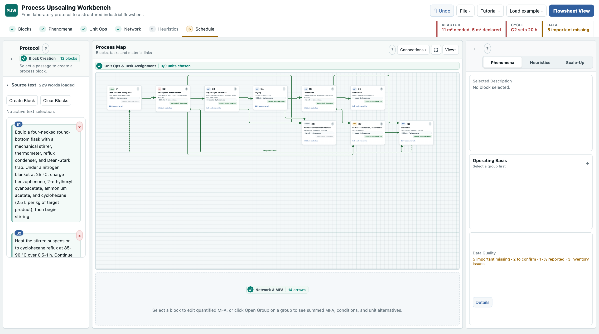
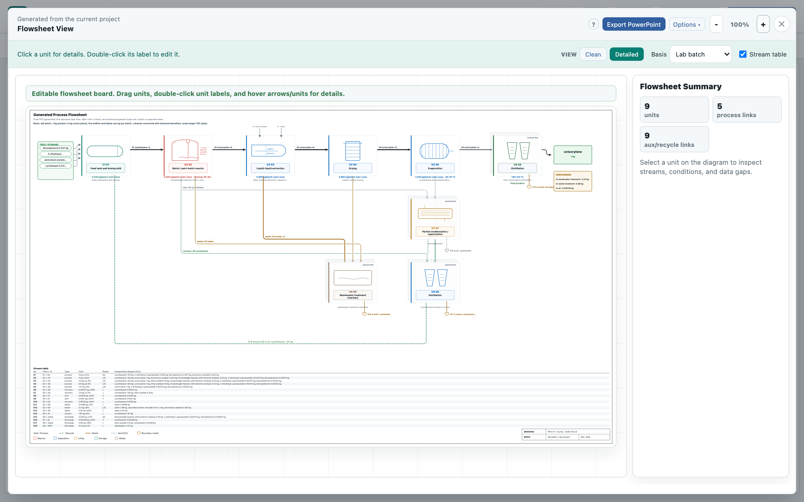

# Process Upscaling Workbench (PUW)

[](https://github.com/jakxsor/Process-Upscaling-Workbench-PUW-v0.3.1/actions/workflows/validation.yml)
[](LICENSE)
[](pyproject.toml)
<!-- Once Zenodo mints the concept DOI, add:
[](https://doi.org/10.5281/zenodo.XXXXXXX)
-->

A local, browser-based workbench that turns a laboratory synthesis protocol
into a structured, quantified industrial process: annotated protocol blocks,
task groups, material flows with declared provenance, unit-operation
candidates, separation screening, a preliminary scale-up basis, and a schematic
flowsheet with editable PowerPoint and life cycle inventory (LCI) exports.

It is the software companion to a phenomena-based scale-up methodology for
prospective life cycle assessment (see [Citing](#citing)). Every quantity
carries its status - reported, calculated, estimated or missing - and every
estimate carries the published source it was derived from.





## Contents

- [Quick Start](#quick-start)
- [What It Does](#what-it-does)
- [Workflow](#workflow)
- [Built-In Examples](#built-in-examples)
- [Reliability Level](#reliability-level)
- [Methodological Scope](#methodological-scope)
- [Saving And Exporting](#saving-and-exporting)
- [Data Sources](#data-sources)
- [Validation Checks](#validation-checks)
- [Deploy on Render](#deploy-on-render)
- [Code Layout](#code-layout)
- [Citing](#citing)
- [Releasing a Version](#releasing-a-version)

## Quick Start

Requirements: Python 3.9 or newer and a modern browser. The two Python
dependencies (`openpyxl`, `python-pptx`) are only needed for the Excel and
PowerPoint exports.

```bash
python3 -m pip install -r upscaling_pipeline_tool/requirements.txt
python3 start.py
```

The launcher starts a local server and opens the browser. If it does not, open
`http://127.0.0.1:8787`. Use `--port` to pick a port and `--no-browser` for
headless or remote use:

```bash
python3 start.py --port 8787 --no-browser
```

Optional editable install for development:

```bash
python3 -m pip install -e .
process-upscaling-workbench --no-browser
```

<details>
<summary><strong>Windows</strong></summary>

1. Install Python from https://www.python.org/downloads/windows/ and enable
   **Add Python to PATH** during installation.
2. Download this repository (**Code -> Download ZIP**) and extract it.
3. Open PowerShell in the extracted folder and run:

   ```powershell
   python -m pip install -r upscaling_pipeline_tool/requirements.txt
   python start.py
   ```

   If `python` is not recognised, use `py` instead of `python`.
4. Open `http://127.0.0.1:8787` in the browser.

</details>

Nothing leaves the machine except optional, per-compound PubChem lookups that
the user triggers explicitly (see [Data Sources](#data-sources)). Projects are
saved in the browser and can be exported as JSON.

## What It Does

- **Protocol to blocks.** Select passages of the source text to create
  annotated process blocks, then assign behaviour presets, phenomena, phases
  and operating conditions to each.
- **Quantified material flows.** Add inputs and outlets per block - products,
  intermediates, waste, emissions, recoveries and recycle candidates - with a
  provenance status on every quantity. A stoichiometric balance mode derives
  product and residual masses from reactive inputs, molecular weights,
  coefficients and declared yield.
- **Task groups.** Combine blocks into task groups that aggregate their
  material flows and conditions while keeping block-level detail.
- **Unit-operation alternatives.** Deterministic suggestions from the grouped
  phenomena, phase context and conditions, gated until the task carries enough
  data to support the choice.
- **Heuristic checks.** A rule set that proposes, explains and waits for the
  user's accept, reject or override before anything on the flowsheet changes.
- **Separation screening.** An optional post-reaction screening after Lutze and
  Garg: pairwise substance comparison, property evidence and phase
  compatibility, with a Basic guided pathway and an Advanced sandbox.
- **Scale-up basis.** Target product, production target, yield, recovery,
  design margin, OEE, operating schedule and parallel units; material flows
  scaled to batch, hourly and annual views.
- **Flowsheet.** A generated process flow diagram with a closed plant boundary:
  every waste or vent stream without a destination leaves through a numbered
  off-page connector and is totalled in a discharge box.
- **Schedule.** A schematic Gantt chart with cycle time, bottleneck, schedule
  margin and the operation-specific data still missing for a quantitative
  correction.
- **Exports.** An LCI workbook for inventory mapping, an editable PowerPoint
  flowsheet (units and streams as grouped objects, not a picture), and a
  portable JSON project file.

## Workflow

1. Paste or load the source protocol.
2. Select text and create blocks.
3. Assign behaviour presets, phenomena, phases, conditions, and MFA streams.
4. Combine related blocks into task groups.
5. Choose unit-operation alternatives and record the selection basis.
6. Run heuristic checks and optional Lutze separation screening where useful.
7. Define the scale-up basis and review scaled MFA results.
8. Use the Gantt panel to inspect cycle time, bottlenecks, schedule margin, and
   missing operation-specific scale-up data.
9. Save snapshots from the File menu, or export JSON as a portable reloadable
   project backup.
10. Export LCI Excel for review/openLCA mapping, or downstream JSON for custom
    tooling.

A guided tutorial (short tour or full 34-step walkthrough) is available from the
header.

## Built-In Examples

Both cases load from the **Load example** menu.

| Case | What it demonstrates | Quantification and sources |
| --- | --- | --- |
| **Octocrylene** (Knoevenagel condensation, cyclohexane recycle) | Grouped reaction and work-up, solvent recovery/recycle, reaction conversion balance with product, byproduct and unreacted reagent streams, optional Lutze screening, scale-up from a lab basis to 750 t/yr, heuristic review, Gantt bottleneck screening. | Source-reconciled fixture for the paper's case study (Section 3 and SI): nine protocol-derived blocks plus three scale-up additions, nine task groups, a 20 h limiting plant cycle at roughly 250 batches/yr. Quantities the SI names but does not report are entered as engineering estimates, each labelled with its method and source (40 CFR 63.1257 vent equations, Hischier et al. 2005, Geisler et al. 2004, Directive 2010/75/EU, the process patent). Thermal properties of the two case-specific esters come from SCCS/1627/21 and supplier data. |
| **Biodiesel** (base-catalysed transesterification of triolein) | A fully quantified train: glycerol-phase decanting, methanol recovery and recycle, water washing, vacuum drying and polishing filtration to EN 14214. Also offered as *screen with Lutze*: make-up and reactor only, so the downstream train is built with the separation screening. | 6:1 methanol-to-oil, 1 wt% NaOH, 60 °C, 1 h, 97.5 % conversion (Freedman, Pryde and Mounts, JAOCS 61, 1984; Van Gerpen, Fuel Processing Technology 86, 2005). Every stream carries mass, phase, provenance and handbook properties (NIST WebBook, CRC, PubChem). Methanol partition and wash losses are typical engineering values, labelled estimated. |

In the octocrylene case, the benzophenone <0.5% endpoint is used only as an
explicit 99.5% screening-conversion proxy to demonstrate residual-stream
generation; it is not presented as a reported yield. The case also exposes the
SI's unresolved capacity conflict: 3000 kg of product requires 7.5 m³ of
cyclohexane alone at 2.5 L/kg, which cannot fit in the stated 5 m³ reactor
before reactants and freeboard are considered. Estimates stay labelled
"estimated" until replaced from the authors' notebook.

## Reliability Level

The current version is suitable for:

- reproducible early-stage screening;
- framework demonstration;
- identifying missing data before scale-up;
- comparing task grouping and unit-operation alternatives;
- producing a transparent scaled MFA skeleton;
- finding schematic bottlenecks from declared or extracted task durations.

The current version is not intended to:

- replace reactor, filter, dryer, distillation, or heat-exchanger design;
- automatically convert lab durations into validated industrial durations;
- infer physical properties or kinetic data without user-provided evidence;
- claim a fully optimized separation train from limited property data.

It performs deterministic calculations where the inputs are available, and
otherwise reports missing data, assumptions, and low-confidence scale-up risks.

## Methodological Scope

The software is intended as a paper-companion and screening implementation. It
keeps assumptions visible and separates entered, calculated, estimated, and
assumed values. The output should be interpreted as a transparent scale-up
proposal, not as validated process design.

The unit-operation suggestion layer is deterministic. It uses the task class,
MFA role/phase context, operating conditions, and optional Lutze-style
separation evidence when available. Suggestions are gated until the task has
enough material streams, phase labels, and conditions to support the choice.

In Stoichiometric Balance mode, the selected product amount is calculated from
the limiting-reagent extent and product coefficient, then multiplied by the
declared yield. Conversion controls unreacted reagent quantities; selectivity is
kept as a separate consistency assumption. Missing amounts, coefficients, MW,
or supported units block saving rather than being silently replaced by a valid
number. This is a reaction-stage material balance, not a kinetic model.

The Lutze Reaction-Separation sandbox is optional. It compares active
post-reaction substances pairwise and proposes draft separation moves from
property contrasts and phase compatibility. The main flowchart is unchanged
until the user explicitly applies a selected pathway. The sandbox does not
perform rigorous thermodynamic modelling, equipment sizing, or economic
optimization.

For scheduling, the tool uses:

```text
adjusted duration = input duration x (1 + Gantt margin %)
effective duration = adjusted duration / parallel units, except kinetics-bound stages
kinetics-bound effective duration = adjusted duration
batch makespan = latest finish in the explicit task-dependency graph
plant cycle time = largest task effective duration
bottleneck = longest zero-slack task on the dependency critical path
```

For campaign scheduling, the UI also shows an overlapped scenario:

```text
productive hours/year = operating days x operating hours/day x OEE
overlapped batches/year = productive hours/year x parallel trains / plant cycle time
conservative batches/year = productive hours/year x parallel trains / batch makespan
```

The overlapped scenario is an upper-throughput screening case. It assumes that
equipment, buffers, cleaning, operators, and material stability allow staggered
batches.

If operation-specific data are missing, the Gantt keeps the input duration and
reports the missing data needed for quantitative correction.

## Saving And Exporting

The File menu stores autosave and manual snapshots in the current browser.
`Export JSON` downloads a portable `upscaling-project.json` file with both the
derived analysis tables and a reloadable `projectState` section; use `Import
JSON` to reopen that file later. `LCI Excel` is a review workbook for inventory
mapping and is not a direct openLCA JSON-LD package.

The PowerPoint export writes the flowsheet as editable objects, not a picture of
a drawing. Each unit is one group holding its equipment symbol, tag, load and
task, so it moves as a piece; each stream is one group holding its arrow and
label. The equipment symbol is the one picture, placed behind the unit's text
as a vector with a PNG fallback, because a jacketed reactor or a tray column
has no PowerPoint primitive. Text is sized in drawing units, so labels keep
their proportions on a large flowsheet instead of overflowing their shapes.

## Data Sources

The optional pure-component property lookup (compound search/autocomplete and
property prefill) queries the [PubChem](https://pubchem.ncbi.nlm.nih.gov/)
PUG-REST/PUG-View API live, per compound, on user request. PubChem is
maintained by the National Library of Medicine (NLM), part of the US National
Institutes of Health (NIH). Data returned is shown with its PubChem CID and a
link back to the source record; nothing is bulk-downloaded or redistributed as
a standalone dataset.

If you reuse or publish results derived from that data, PubChem requests
acknowledgment of NLM, e.g.:

> Kim S, Chen J, Cheng T, Gindulyte A, He J, He S, Li Q, Shoemaker BA,
> Thiessen PA, Yu B, Zaslavsky L, Zhang J, Bolton EE. PubChem 2025 update.
> Nucleic Acids Res. 2025;53(D1):D1516-D1525. https://doi.org/10.1093/nar/gkae1059

## Validation Checks

The repository ships regression checks for the software workflow (not
experimental validation of the chemical process). From the repository root:

```bash
python3 scripts/validate.py
```

The runner syntax-checks every served JavaScript file, compiles the Python entry
points, and runs the workflow, physical-plausibility, project import, UI-wiring,
PubChem, LCI Excel, PowerPoint export and optional browser smoke checks. It
prefers the local `.venv` interpreter when present. The same checks run in CI
on every push (see the badge above).

<details>
<summary>Individual checks</summary>

```bash
node --check upscaling_pipeline_tool/static/app.js
node --check upscaling_pipeline_tool/static/examples.js
node --check upscaling_pipeline_tool/static/flowsheet.js
node --check upscaling_pipeline_tool/static/flowsheet_ui.js
node --check upscaling_pipeline_tool/static/lca_bridge.js
node --check upscaling_pipeline_tool/static/process_catalogs.js
node --check upscaling_pipeline_tool/static/workflow_readiness.js
node scripts/check_complete_separation_flow.js
node scripts/check_separation_simulator.js
node scripts/check_property_screening.js
node scripts/check_flowsheet_view.js
node scripts/check_project_persistence.js
node scripts/check_tutorial_flow.js
node scripts/check_ui_wiring.js
python3 scripts/check_flowsheet_pptx_export.py
python3 scripts/check_lci_xlsx_export.py
python3 -m py_compile start.py run_upscaling_tool.py upscaling_pipeline_tool/app.py upscaling_pipeline_tool/pptx_renderer.py upscaling_pipeline_tool/xlsx_renderer.py
node scripts/check_browser_smoke.js
```

The last line drives the served application in headless Chromium and asserts
what the static checks cannot see: the page loads without a runtime error, the
process board opens legible with every group inside the panel, the rule check
produces a local report, the inventory readiness card renders, and the
flowsheet opens. It needs Playwright and a Chromium build and prints `SKIP`
(exit 0) when either is missing:

```bash
npm install --no-save playwright@1.54.0
npx playwright install chromium
node scripts/check_browser_smoke.js
```

</details>

## Deploy on Render

The repository includes a `render.yaml` Blueprint for deploying the workbench as
a Render web service: push the repository to a Git provider connected to Render,
choose **New > Blueprint**, and select it. The Blueprint installs
`upscaling_pipeline_tool/requirements.txt`, starts
`python3 -m upscaling_pipeline_tool.app --host 0.0.0.0`, reads Render's `PORT`
variable automatically, and defaults to the Frankfurt region on the free plan.

## Code Layout

```text
start.py                                   One-command launcher (server + browser)
run_upscaling_tool.py                      Server-only entry point
upscaling_pipeline_tool/app.py             Local HTTP server and HTML shell
upscaling_pipeline_tool/static/            Client-side app, styling, examples, catalogs
upscaling_pipeline_tool/pptx_renderer.py   PowerPoint flowsheet export
upscaling_pipeline_tool/xlsx_renderer.py   LCI workbook export
upscaling_pipeline_tool/pubchem_lookup.py  PubChem property lookup
scripts/                                   Validation runner and regression checks
docs/images/                               README screenshots
```

Local backup snapshots may exist under `saved_states/`, but that directory is
ignored by git.

## Citing

This repository implements the phenomena-based upscaling framework described in:

> Sorani, J., Majo, M., Nowack, B., Hischier, R. "Generalized Scale-Up
> Methodology for Chemicals and Materials in Prospective LCA." [journal,
> publication details to be added]

If you use this tool in your work, please cite the paper above. To cite the
software itself, use the **Cite this repository** button on GitHub (generated
from `CITATION.cff`) or the Zenodo concept DOI once it is listed at the top of
this file; the concept DOI always resolves to the newest archived release.

## Releasing a Version

Maintainer notes. The software is archived on Zenodo, which mints a DOI for each
GitHub release and a concept DOI that always resolves to the newest one. Zenodo
only archives releases created after the repository is enabled, so the first
step happens once.

1. On zenodo.org, sign in with GitHub, open Settings then GitHub, and switch
   this repository on.
2. Merge the release branch into `main`, since the release should be tagged on
   the default branch.
3. Check that `.zenodo.json`, `CITATION.cff` and `pyproject.toml` all carry the
   version about to be released, and that `CHANGELOG.md` describes it.
4. Tag and publish a GitHub release, for example `v0.3.1`. Zenodo archives the
   tagged tree and mints the DOI within a few minutes.
5. Put the DOI back into the repository: an `identifiers` entry in
   `CITATION.cff`, a `related_identifiers` entry in `.zenodo.json` pointing at
   the paper with relation `isSupplementTo`, and the badge at the top of this
   file. Commit that on `main`; it applies to the next release.

`.zenodo.json` carries the archive's metadata. Author names there follow
`CITATION.cff`; add ORCIDs and affiliations before a release, since Zenodo
shows them on the record and they cannot be changed silently afterwards.

## License

MIT - see [LICENSE](LICENSE).
